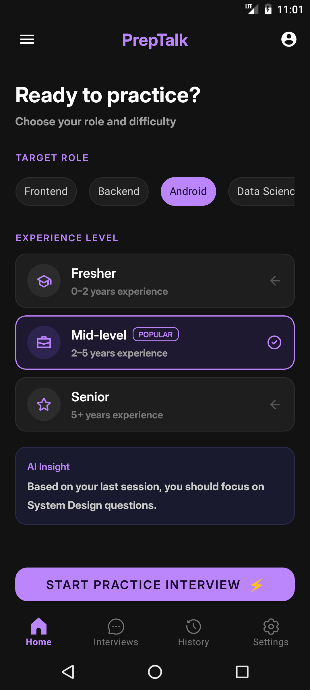
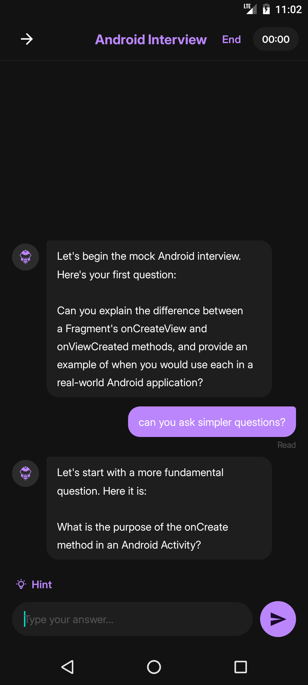
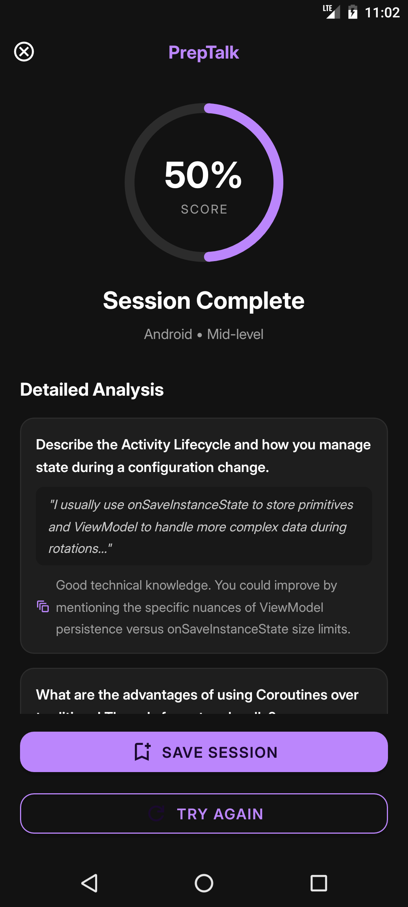
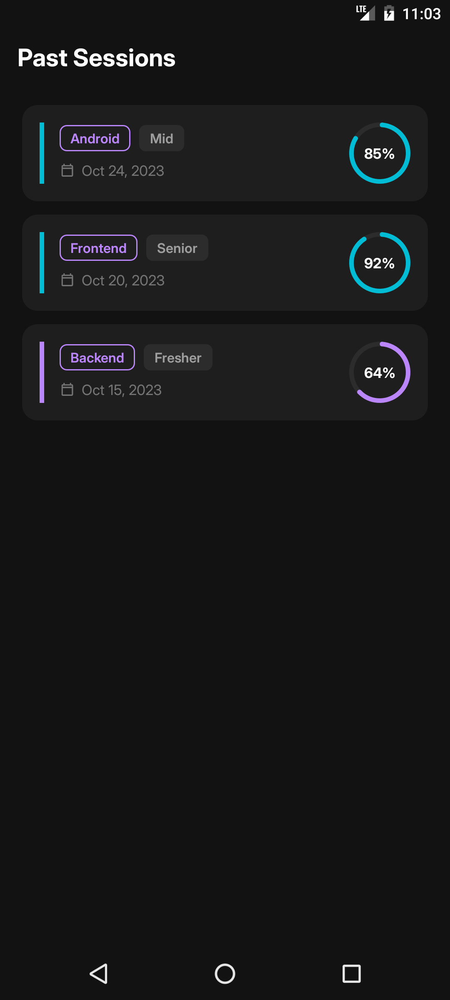

# PrepTalk 🎙️

**An AI-powered mock interview coach for Android**

PrepTalk helps developers practice technical interviews with real-time AI feedback. Choose a role and difficulty level, get interviewed by an AI coach that asks relevant questions one at a time, receive instant feedback after each answer, and walk away with a detailed score breakdown.

Built as a portfolio project to sharpen my own interview skills while demonstrating practical Android development and LLM integration.

---

## ✨ Features

- 🎯 **Role-based interviews** — Android, Frontend, Backend, Data Science, DevOps
- 📊 **Difficulty levels** — Fresher, Mid-level, Senior
- 💬 **Real-time conversational AI interviewer** with instant feedback after each answer
- 📈 **Session summary** — overall score with detailed per-question analysis
- 🕑 **Interview history** — track past sessions and progress over time
- 🌙 **Clean, modern dark UI**

---

## 📱 Screenshots

| Home | Chat | Summary | History |
|------|------|---------|---------|
|  |  |  |  |

---

## 🛠️ Tech Stack

- **Language:** Kotlin
- **Architecture:** MVVM (Model-View-ViewModel)
- **UI:** XML Views, Material Components
- **Networking:** Retrofit + Gson
- **Async:** Kotlin Coroutines
- **State management:** ViewModel + LiveData
- **Local storage:** Room DB
- **LLM Integration:** Groq API (Llama 3.3 70B)

---

## 🏗️ Architecture

```
com.example.preptalk/
├── ui/              → Activities & Fragments (Home, Chat, Summary, History)
├── viewmodel/       → ViewModels holding UI state
├── repository/      → Single source of truth, decides API vs local data
├── network/         → Retrofit setup and API service interface
├── db/              → Room database, DAOs, entities
├── model/           → Data classes shared across layers
└── utils/           → Constants, PromptBuilder, helper extensions
```

The app follows a clean **MVVM** pattern:

```
UI (Activity) → ViewModel → Repository → Network / Local DB
```

---

## 🧠 How It Works

1. User selects a **role** and **difficulty level** on the Home screen
2. `PromptBuilder` constructs a tailored system prompt based on the selection
3. The AI asks one question at a time, evaluates the answer, and gives brief feedback
4. After a fixed number of questions, the AI returns a structured summary with a score
5. The session can be saved locally and reviewed later in the History screen

---

## 🚀 Getting Started

### Prerequisites
- Android Studio (latest stable)
- A free [Groq API key](https://console.groq.com)

### Setup

1. Clone the repo
   ```bash
   git clone https://github.com/TaankKrish/PrepTalk.git
   ```

2. Add your API key to `local.properties`:
   ```properties
   GROQ_API_KEY=your_groq_api_key_here
   ```

3. Sync Gradle and run the app on an emulator or device (minSdk 24+)

---

## 📌 Roadmap

- [ ] Complete Room DB integration for persistent session history
- [ ] Add more interview roles and custom difficulty tuning
- [ ] Support voice input for answers
- [ ] Migrate UI to Jetpack Compose

---

## 📄 License

This project is open source and available for learning purposes.

---

## 🙋‍♂️ About

Built by [Krish](https://github.com/TaankKrish) as a portfolio project to demonstrate Android development skills, clean architecture, and practical LLM integration — while preparing for internship interviews myself.
